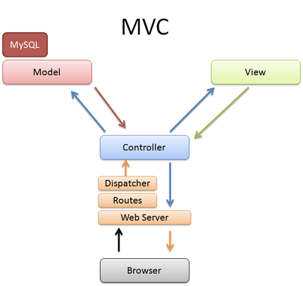

# O que aprendemos?
## 01.Uma entrada para as requisições
* É uma boa prática ter uma entrada única na aplicação web;
* Se na URL não foi especificado um arquivo, o servidor PHP automaticamente chamará o arquivo `index.php`;
* Se uma rota/URL não foi encontrada devemos devolver o status HTTP 404;
* Também é boa prática usar URLs amigáveis (mais legíveis);
* PHP possui uma variável "super global" chamada `$_SERVER` que tem vários informações úteis sobre a requisição;
* Através dela podemos obter a URL: `$_SERVER['PATH_INFO']`;
* Podemos usar o comando `switch`, `case`, `default` para tomar decisões no código.
 
## 02. Entendendo o _Model View Controller(MVC)_
* Conhecemos o padrão arquitetural MVC
* MVC define 3 camadas:
* Modelo: Classes com a lógica de negócio e persistência
* View: Arquivos com o código HTML
* Controller: Classes que ligam o Model e View
* Vimos também que existe um FrontController (também chamado de Dispatcher)
* Ele representa a entrada da aplicação e recebe todas as requisições
* Ele decide qual controller específico a usar
* 
* O padrão MVC não nasceu especificamente para a web;
* O padrão sofreu algumas adaptações para funcionar e atender as aplicações web;
* Por isso também é chamado de MVC Web, MVC Tipo 2 ou MVC Action Based.